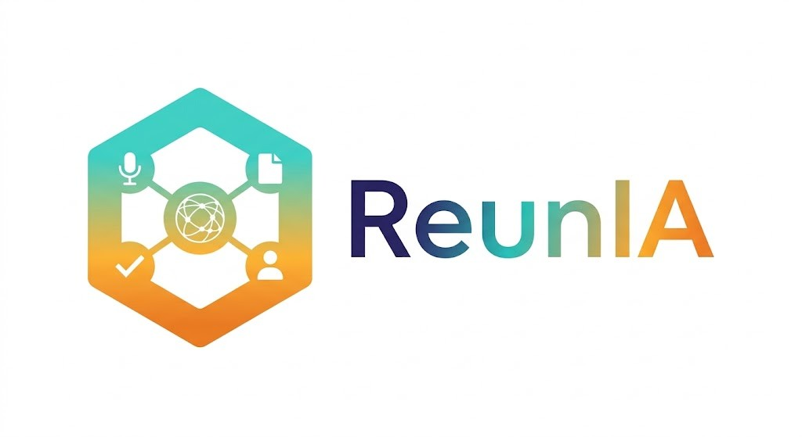
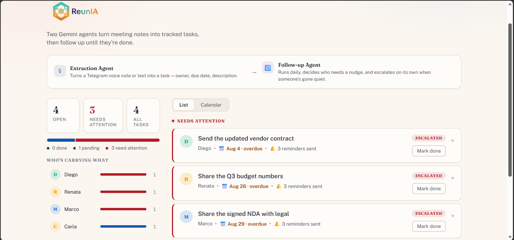
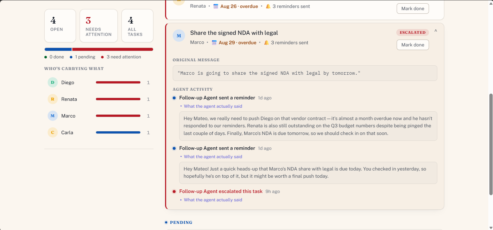
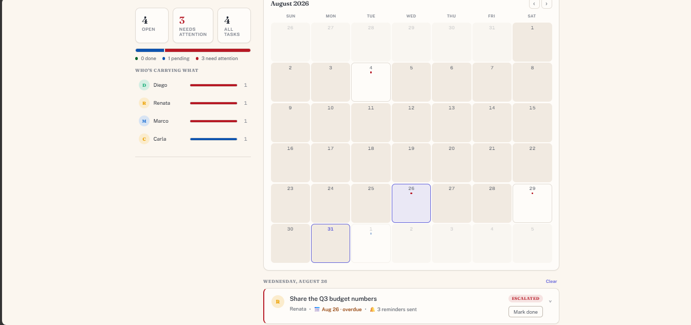

<p align="center">
  
</p>

# ReunIA

**The friction:** meetings produce commitments ("I'll send you the report Friday," "Carla owes me the deck by next week"), but nobody writes them down, and even when someone does, nobody chases them. ReunIA fixes both halves: send it a voice note or text after a meeting and it extracts every action item on its own; from then on, a second agent silently watches your whole list of open commitments and only speaks up when something actually needs your attention — no dashboard-checking, no manual reminders, no per-task notifications required.

It's two autonomous Gemini agents wired to one Telegram bot and one Firestore database, plus a small dashboard to see what they're doing:

1. **Extraction Agent** — turns a voice note or text message into structured tasks the moment it arrives.
2. **Follow-up Agent** — runs on its own every day, reasons over *every* open task at once (not one at a time), and decides who needs a nudge, who needs to be escalated, and who can wait — then sends a single message with everything that matters.

Built for the **All Things Agentic Hackathon** — **Taskmaster** track (Bring Your Own Friction: this automates a real personal chore — tracking and chasing commitments from my own meetings).

## Mandatory requirements checklist

| Requirement | How this project satisfies it |
| --- | --- |
| Gemini 3.5 (or newer) via Gemini API / Vertex AI | `gemini-3.5-flash`, called through **Vertex AI** (`GOOGLE_GENAI_USE_VERTEXAI=True`), authenticated with Application Default Credentials — no API key needed |
| A Google Agent Framework | **Google ADK** (`google-adk`) — both agents are `google.adk.agents.Agent` instances run through `InMemoryRunner`, one of them with a real ADK tool (`get_task_events`) |
| A Google Cloud infrastructure service | **Cloud Functions (2nd gen, built on Cloud Run)** for both agents, **Firestore** as the database, **Cloud Scheduler** to trigger the autonomous run |

## How it works

![Architecture diagram: two independent flows share one Firestore database. A human-triggered flow (indigo, "Triggered by you") goes Telegram -> Extraction Agent -> Firestore -> confirmation back to Telegram. An autonomous flow (amber, "Triggered by the clock") goes Cloud Scheduler -> Follow-up Agent -> Firestore (with an optional tool call to check a task's reminder history) -> a consolidated digest back to Telegram, running daily with no human involved. A dashboard reads and writes Firestore directly, bypassing both Cloud Functions (teal, "Live view, no Cloud Function").](docs/Architecture.jpg)

There are two independent flows sharing one Firestore database, plus a dashboard that reads/writes it directly:

- **Triggered by you (indigo):** Telegram → Extraction Agent → Firestore → confirmation back to Telegram.
- **Triggered by the clock (amber):** Cloud Scheduler → Follow-up Agent → Firestore (with an optional tool call back into Firestore to inspect a task's history) → one consolidated digest back to Telegram. Runs daily, end to end, with no human involved.
- **Live view (teal):** the dashboard talks to Firestore directly — no Cloud Function in that path.

### Extraction Agent

Cloud Function, triggered by a Telegram webhook on every message.

- Voice note → downloaded from Telegram, sent straight to Gemini for transcription.
- Text message → used as-is.
- Gemini (via ADK, structured output) extracts every action item as `{ description, owner_name, due_date }`, resolving relative dates ("next Friday") against the message's actual date.
- Each task is written to Firestore, then a confirmation summarizing what was registered is sent back on Telegram.

### Follow-up Agent

Cloud Function, triggered daily by Cloud Scheduler — nobody has to open the app or ask for a status update.

- Loads every `pending` task, grouped by chat, and hands the **entire list at once** to Gemini — not one classification call per task. This is what lets it notice things a per-task loop can't: the same person behind on three separate items, or one task that's dramatically more overdue than the rest.
- For each task it decides `remind`, `escalate`, or `skip`, and drafts **one** consolidated Telegram message — never one message per task.
- It has a real ADK tool, `get_task_events(task_id)`, and decides for itself when to call it: a raw `reminder_count` can't tell whether those reminders were spread over three stuck weeks or fired twice in the last two days, so for ambiguous cases it pulls the actual timestamped history before deciding how urgent to be.
- The message is always addressed to the person who owns the Telegram chat — never to a task's owner (they never talk to the bot) — because escalation here means "get Mateo's attention," not "message a third party."
- Firestore is updated (`reminder_count`, `status`, `escalated`) and every autonomous action is appended to a `tasks/{id}/events` audit trail — the proof that this ran with no human in the loop.

### Dashboard

A React app that reads and writes Firestore directly — no backend of its own. List and calendar views, grouped by status (things needing attention surfaced first), a workload breakdown by owner, and a "mark done" action. Access is gated by Firestore Security Rules rather than a login: anyone can read, but a client can only ever change a task's `status`/`updated_at`, nothing else (see `dashboard/README.md`).

| List view | Task detail |
| --- | --- |
|  |  |

Escalated tasks surface first, with the exact reminder/escalation messages the Follow-up Agent sent — not just a status label — visible per task. There's also a calendar view for seeing everything by due date:



Full data contract: `docs/firestore-schema.md` (Firestore schema) and `docs/telegram-webhook-contract.md` (Telegram + Cloud Scheduler request/response contract).

## Tech stack

| Layer | Technology |
| --- | --- |
| Model | Gemini 3.5 Flash, via Vertex AI |
| Agent framework | Google ADK (`google-adk`) — structured `output_schema`, one agent with a real tool |
| Compute | Cloud Functions, 2nd gen (Cloud Run under the hood) |
| Scheduling | Cloud Scheduler (daily cron, OIDC-authenticated invocation) |
| Database | Firestore, native mode |
| Messaging | Telegram Bot API (webhook in, `sendMessage`/`getFile` out) |
| Frontend | React 19 + Vite, `firebase` JS SDK (Firestore client only) |
| Hosting (dashboard, optional) | Firebase Hosting |

**Data source:** this project's only external data is whatever the user actually says in their own meetings — voice notes or text sent to a personal Telegram bot. There's no synthetic corpus or third-party dataset; the "messy, unstructured input" the hackathon asks for is real, unedited speech, transcribed and structured entirely by the Extraction Agent.

## Project structure

```
extraction-agent/   Cloud Function: Telegram webhook -> transcription -> extraction -> Firestore
followup-agent/     Cloud Function: Cloud Scheduler -> portfolio-wide review -> one digest/chat
dashboard/          React app (Firestore reader/writer, no backend)
docs/               Firestore schema + Telegram/Scheduler contract docs
```

## Spin-up instructions

### 1. Prerequisites

- Python 3.12+, Node 20+
- A Google Cloud project with billing enabled and these APIs turned on:
  ```
  gcloud services enable aiplatform.googleapis.com cloudfunctions.googleapis.com \
    run.googleapis.com firestore.googleapis.com cloudscheduler.googleapis.com
  ```
- `gcloud` CLI authenticated (`gcloud auth login`), with Application Default Credentials set up (`gcloud auth application-default login`) and the project selected:
  ```
  gcloud config set project meeting-followup-agent-mtsv
  ```
- A Telegram bot (see table below for how to create one)
- (optional, only needed for the dashboard) a Firebase project linked to the same GCP project

### 2. Where to get each credential

Copy `.env.example` to `.env` (and `dashboard/.env.example` to `dashboard/.env`) and fill these in:

| Variable | Where it comes from |
| --- | --- |
| `TELEGRAM_BOT_TOKEN` | Open a chat with [@BotFather](https://t.me/BotFather) on Telegram, send `/newbot`, and follow the prompts (a display name, then a username ending in `bot`). BotFather replies with a token that looks like `123456789:AA...` — that whole string is the value. |
| `TELEGRAM_WEBHOOK_SECRET` | Not issued by anyone — you make it up yourself (e.g. `openssl rand -hex 20`). It's a shared secret Telegram echoes back on every webhook call, which is how `extraction-agent/main.py` rejects requests that aren't really from Telegram. |
| `GCP_PROJECT_ID` / `GCP_REGION` | Your own Google Cloud project id ([console.cloud.google.com](https://console.cloud.google.com) → create/select a project) and the region you deploy the Cloud Functions to. |
| `FIRESTORE_DATABASE` | Leave as `(default)` unless you've created a named Firestore database for the project — the code always connects with `firestore.Client()`, so this value isn't currently read by either agent. |
| `GEMINI_MODEL` / `VERTEX_AI_LOCATION` | Not a credential, just config — which model (`gemini-3.5-flash`) and Vertex AI location (`global`, see *Findings & learnings* below) to call. **No Gemini API key is used anywhere in this project.** Vertex AI is authenticated with whichever identity already runs the code (`gcloud auth application-default login` locally, the Cloud Function's own runtime service account once deployed) — that identity just needs the `roles/aiplatform.user` IAM role. |
| `VITE_FIREBASE_*` (`dashboard/.env` only) | [Firebase console](https://console.firebase.google.com) → add Firebase to the same GCP project → Project settings → General → "Your apps" → add a Web app → copy the `firebaseConfig` object shown there straight into `dashboard/.env` (or run `firebase apps:sdkconfig web <appId>` if you have the Firebase CLI). This is a public client key, safe to ship to the browser — see `dashboard/README.md` for how access is actually locked down with Firestore Security Rules instead. |

### 3. Run locally

Each Cloud Function has its own `requirements.txt`:

```
cd extraction-agent
python -m venv .venv && .venv/Scripts/activate  # Windows
pip install -r requirements.txt
functions-framework --target=extraction_webhook --debug
```

```
cd followup-agent
python -m venv .venv && .venv/Scripts/activate
pip install -r requirements.txt
functions-framework --target=followup_run --debug
```

Dashboard (see `dashboard/README.md` for the Firebase Web SDK config it needs):

```
cd dashboard
npm install
npm run dev
```

### 4. Deploy the agents

Deploys use an `--env-vars-file` (YAML) rather than `.env` directly, since `.env`'s comments/blank lines aren't valid `KEY=VALUE,KEY=VALUE` syntax. Hand-write `extraction-agent/env-vars.yaml` and `followup-agent/env-vars.yaml` (gitignored — never commit these):

```yaml
TELEGRAM_BOT_TOKEN: "..."
TELEGRAM_WEBHOOK_SECRET: "..."   # extraction-agent only
GCP_PROJECT_ID: "meeting-followup-agent-mtsv"
GEMINI_MODEL: "gemini-3.5-flash"
VERTEX_AI_LOCATION: "global"
```

```
gcloud functions deploy extraction-webhook \
  --gen2 --runtime=python312 --region=us-central1 \
  --source=extraction-agent --entry-point=extraction_webhook \
  --trigger-http --allow-unauthenticated \
  --env-vars-file=extraction-agent/env-vars.yaml \
  --memory=512Mi --cpu=1 --timeout=180s

gcloud functions deploy followup-run \
  --gen2 --runtime=python312 --region=us-central1 \
  --source=followup-agent --entry-point=followup_run \
  --trigger-http --no-allow-unauthenticated \
  --env-vars-file=followup-agent/env-vars.yaml \
  --memory=512Mi --cpu=1 --timeout=300s
```

`--memory=512Mi --cpu=1` (the gen2 default is a much smaller `0.1666` CPU) — cold-starting `google-adk` plus a live Gemini call regularly took longer than the default resources allow, causing 504s.

Register the Telegram webhook so Telegram starts calling `extraction-webhook`:

```
curl -X POST "https://api.telegram.org/bot<TELEGRAM_BOT_TOKEN>/setWebhook" \
  -d "url=https://us-central1-meeting-followup-agent-mtsv.cloudfunctions.net/extraction-webhook" \
  -d "secret_token=<TELEGRAM_WEBHOOK_SECRET>"
```

### 5. Schedule the Follow-up Agent

`followup-run` is deployed with `--no-allow-unauthenticated`, so Cloud Scheduler needs a dedicated service account with `roles/run.invoker` on it:

```
gcloud iam service-accounts create scheduler-invoker \
  --display-name="Cloud Scheduler invoker for followup-run"

gcloud run services add-iam-policy-binding followup-run \
  --region=us-central1 \
  --member="serviceAccount:scheduler-invoker@meeting-followup-agent-mtsv.iam.gserviceaccount.com" \
  --role="roles/run.invoker"

gcloud scheduler jobs create http followup-daily \
  --schedule="0 9 * * *" \
  --uri="https://us-central1-meeting-followup-agent-mtsv.cloudfunctions.net/followup-run" \
  --http-method=POST \
  --oidc-service-account-email="scheduler-invoker@meeting-followup-agent-mtsv.iam.gserviceaccount.com" \
  --oidc-token-audience="https://us-central1-meeting-followup-agent-mtsv.cloudfunctions.net/followup-run" \
  --location=us-central1 \
  --time-zone="America/Lima" \
  --attempt-deadline=300s
```

To trigger a run on demand instead of waiting for the schedule: `gcloud scheduler jobs run followup-daily --location=us-central1`.

### 6. Dashboard hosting (optional)

The dashboard is deployed to Firebase Hosting this way. If `firebase login` is authenticated as the same Google account that owns the GCP project, it's just:

```
cd dashboard
npm run build
firebase deploy --only hosting --project meeting-followup-agent-mtsv
```

(`firebase.json` and `.firebaserc` at the repo root already point Hosting at `dashboard/dist`.)

If the Firebase CLI is logged into a *different* Google account than the one with access to the project (which is what happened here — `firebase login:list` showed an account with no visibility into `meeting-followup-agent-mtsv`, while `gcloud` was correctly authenticated as the project owner), skip the CLI and hit the Firebase Hosting REST API directly with a `gcloud` access token instead, the same workaround already used elsewhere in this project for the Management/Rules APIs:

1. `POST .../sites/{siteId}/versions` to create a version.
2. Gzip every file under `dashboard/dist`, hash each with SHA-256, and call `sites.versions.populateFiles` with the `{path: hash}` manifest.
3. `PUT` each gzipped file to the `uploadUrl` the previous call returns, keyed by its hash.
4. `PATCH` the version to `status: FINALIZED`.
5. `POST .../sites/{siteId}/releases?versionName=...` to actually publish it.

All calls authenticated with `Authorization: Bearer $(gcloud auth print-access-token)` plus `x-goog-user-project: meeting-followup-agent-mtsv`.

## Testing notes

The Telegram bot in this build is wired to one personal chat (this is a "bring your own friction" tool solving a real personal workflow, not a public multi-tenant service), so there's no public bot handle to message directly. The demo video shows the full loop end to end — a real voice note in, structured tasks out, and an unattended scheduled run producing an escalation — and the steps above are enough to stand up a fresh instance against your own Telegram bot and GCP project to verify it independently.

The dashboard, though, is deployed and live. It reads real Firestore data written by both agents, so it shows actual tasks, real due dates, and the agents' real reminder/escalation messages without anyone having to deploy anything. Per `dashboard/firestore.rules`, anyone with the link can read, and the "Mark done" button genuinely writes to Firestore (restricted to only the `status`/`updated_at` fields, no create/delete) — that's an intentional simplification for a solo hackathon demo with non-sensitive data, not a production security posture (see `dashboard/README.md`). The live URL is provided in the Devpost submission (hosted project URL / testing instructions) rather than published in this public repo.

## Findings & learnings

- **Reasoning over the whole portfolio beats classifying tasks one by one.** An earlier version of the Follow-up Agent called Gemini once per task to classify it in isolation. It worked, but it couldn't do the thing that actually makes a digest useful: notice that the *same person* is behind on three things, or that one task is far more overdue than everything else. Feeding the entire pending list to a single Gemini call, and asking it to look across tasks before writing, is what unlocked that — and it also collapses N reminder messages into one digest, which is a better experience on its own.
- **A tool call beats a flat threshold for judging staleness.** `reminder_count >= 2` looks like a clean escalation rule, but two tasks with the same count can be totally different in practice — one nudged twice in three weeks (stuck), one nudged twice in two days (still fresh). Giving the agent a real ADK tool, `get_task_events(task_id)`, and instructions on *when* to call it (only for ambiguous cases, not every task) let it use actual timestamps to tell those apart. Verified in production: two tasks with an identical `reminder_count` received different treatment after the agent pulled their real history.
- **A subtle recipient bug only showed up once escalation went live.** The per-task version drafted messages addressed to the task's owner (e.g. "Hola Carla…"), but the bot only ever has a chat with the person who *created* the tasks — task owners never talk to it. Those messages were quietly landing with the wrong person. Reasoning over the whole portfolio and explicitly instructing the agent to always address the chat's owner (never a task's owner) fixed it — a good example of a mistake that's invisible until you check who the message is actually for, not just what it says.
- **`gemini-3.5-flash` (and other recent Gemini models) are only served from Vertex AI's `global` location in this project** — not regional locations like `us-central1`. Infra (Cloud Functions, Firestore) stays in `us-central1`; only the model calls use `VERTEX_AI_LOCATION=global`.
- **Firebase can be set up without an interactive `firebase login`.** That flow needs a real browser, which wasn't available in this dev environment. Firebase was instead added to the GCP project and the web app registered via direct calls to the Firebase Management API (`firebase.googleapis.com`) and Firebase Rules API (`firebaserules.googleapis.com`), authenticated with the already-logged-in `gcloud` user token (`gcloud auth print-access-token`) plus an `x-goog-user-project` header. If you have a working `firebase login`, the equivalent CLI commands are simpler (see `dashboard/README.md`).
- **A stale ADC quota project causes a confusing `PERMISSION_DENIED`.** If Vertex AI calls fail despite correct IAM roles, check `gcloud auth application-default set-quota-project` — leftover Application Default Credentials from a different project/account on the same machine reproduce exactly this symptom.
